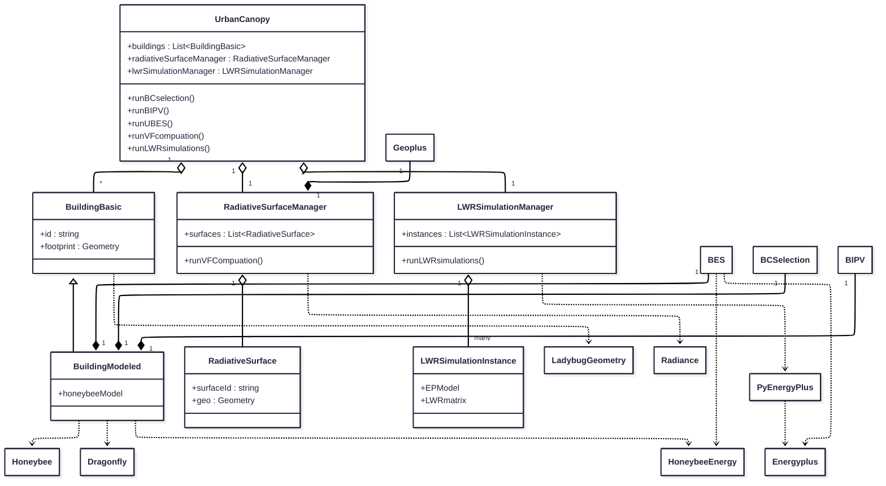

# BUA: Building Urban Analysis


**BUA** is a comprehensive urban building energy simulation (UBES) platform. Developed as a core component of a PhD thesis at the **Technion - Israel Institute of Technology**, it automates the generation of simulation-ready urban models, enabling district-scale analysis of energy performance, solar potential, and inter-building longwave radiative (LWR) exchanges.


---
> **⚠️ Development Status**
> 
> This codebase and README file ared currently under active polishing.
> 
> The first **stable release**, which will include full integration for **Inter-Building Longwave Radiation (LWR)** computation, is scheduled to be published soon.
---

## 🚀 Key Features

### 1. Pipeline
* **Data Ingestion:** Imports raw geometric data from common GIS, Brep, and *EnergyPlus* formats.
* **Automated Modeling and Simulation:** Automated modeling and simulation of for the selected target buildings.
* **Standard Outputs:** Standard building energy simulation outputs for seemless integration in existing worflow.

### 2. Application
* **Standard Urban Building Energy Simulation:** Computation of the enegy comsumption of building in their urban environment, with a smart shading selection from neighboring buildings.
* **BIPV Assessment:** Evaluation of energy, economical and environmental key perfomance indicators of **Building Integrated Photovoltaics (BIPV)** installation for quick prototyping, using life cycle assessment (LCA), life cycle cost analysis (LCCA), radiation anlysis and PV panel modeling. Part of a funded research initiative with the **Israeli Ministry of Energy** to quantify BIPV potential at the district scale.
* **LWR-aware Urban Building Energy Simulation:** Computation of building energy consumption, considering the LWR among buildings, partially responsible of the urban heat island effect. This computation is achieved by simulating neighbors of the target buildings (with a smart boundary condition selection), sycnhronizing the simulation with the target buidings, sharing the surface temperatures of all buildings and resolving the radiation balance on each surface (using the radiosity formulation).

### 3. Smart Simulation Domain
* **Boundary Condition Optimization:** Novel geometric algorithms (minimum view factor criterion) to identify and select only the relevant surrounding shading surfaces and buildings to include in the couple inter-building LWR simulation.
* **View Factor Computation Optimization:** Novel selection technique (using the minimum view factor criterion) to identify the view factors (geometrical factors necesary for the LWR computation) worth computing.

### 4. Integration
* **Ladybug Tools (LBT):** Features deep integration with the *Ladybug Tools* ecosystem, using the *Ladybug*, *Honeybee* and *Dragonfly* objects as a fundation of the new classes.
* **EnergyPlus:** For building simulatio. The coupled dynamic LWR simulation uses *EnergyPlus* API *pyenergyplus* to synchronize the simulation of each building and share the surfaces temperatures.
* **Radiance:** For BIPV hourly irradiance simulation (through *Honeybee-Radiance*) and for view factor computation (using *cmd*)

---

## 🛠️ Installation (Windows)

This package is designed for **Windows** environments. Development for a **Linux** version is considered, though the compatibility with the *LadybugTools* is questioned as to our knowledge no installer exist for *Linux* and it is uncertain if only installing the python libraries is sufficient.

### Prerequisites
* Python 3.10+
* LadybugTools/Pollination for Grasshopper

### Option 1: Standard Installation
This method runs the included setup script to install the default input files and folder for user inputs.

Just install normally the package from the last github release:

```bash
pip install https://github.com/Eliewiii/BUA/archive/refs/tags/last_release_tag.tar.gz
```

### Option 2: Skip Setup Script to install default inputs
If you don't want to overwrite the default inputs by rerunning the setup script, you can set a SKIP_SETUP_SCRIPT environment variable to True.

```cmd
set SKIP_SETUP_SCRIPT=true
pip install https://github.com/Eliewiii/BUA/archive/refs/tags/**last_release_tag**.tar.gz
```

```powershell
$env:SKIP_SETUP_SCRIPT="true"
pip install https://github.com/Eliewiii/BUA/archive/refs/tags/**last_release_tag**.tar.gz
```

Separating default from user data is already implemented, but the code for now does not look for inputs (especially BIPV data in json files) in the user folder yet, so new user data needs to be added to the default folder and will be deleted when installing a new release, hence the SKIP_SETUP_SCRIPT workaround in the meantime.

---

## 🏗️ Architecture

Here is a simplified but still exhaustive class diagram of the project.

BUA is dependent on 3 packages we designed for the LWR coupled simulation:
* **[radiance_comp_vf](https://github.com/Eliewiii/View_Factor_Computation_With_Radiance):**: for the smart computation of view factors, which returns a view factor sparse matrix.
* **[geoplus](https://github.com/Eliewiii/geoplus_geometry_extension):**: to handle, simplify and compute properties of 3D planar surfaces (area, normal, hole contouring, corner vertices etc.), ensuring compatibility with *Radiance*. Standard library would usually fail to properly compute the normal and area of surfaces with countoured holes (very common in our application with windows on building surfaces).
* **[lwrepcoupling](https://github.com/Eliewiii/EP_LWR_coupled_simulation):**




## 📂 Project Structure

* `src/`: Core Python source code for the BUA framework.
* `examples/`: Sample scripts demonstrating how to load geometry and generate simulation inputs.
* `Documentation/`: Technical documentation and algorithm descriptions.

---

## 🎓 Context & Credits

**Author:** Elie Medioni, PhD  
**Institution:** Technion - Israel Institute of Technology  

This software was developed to support advanced research in **Urban Building Energy Modeling (UBEM)**. It serves as the geometric backbone for coupled simulations, including the integration of **Inter-Building Longwave Radiation** (see [EP_LWR_coupled_simulation](https://github.com/Eliewiii/EP_LWR_coupled_simulation)).

---

## 📄 License

This project is licensed under the MIT License - see the [LICENSE](LICENSE) file for details.

